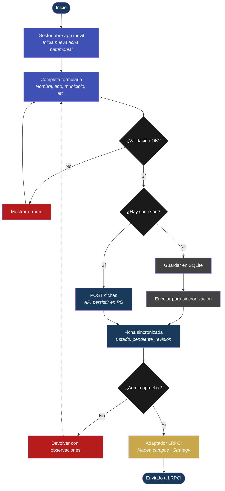
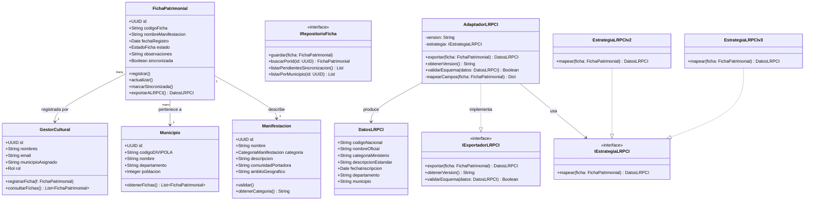
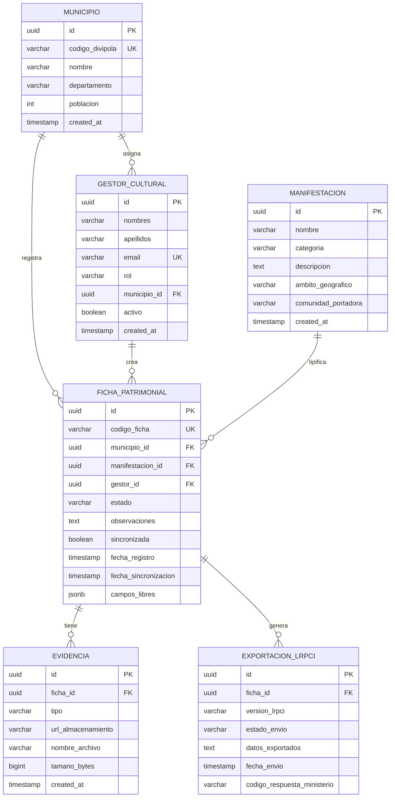

# PatrimonioNariño
## Sistema de Inventario del Patrimonio Cultural Inmaterial · Gobernación de Nariño

---

**Documento de Arquitectura de Software · v1.0**  
**Materia:** Arquitectura de Software  
**Integrantes:** Julian Pedroza Ospina, Catalina Gaviria, Esteban Lasso, Marlon Andrade  
**Semestre:** 5to Semestre  
**Institución:** Universidad Cooperativa de Colombia (UCC) - Campus Pasto  
**Mayo 2026** | **Clasificación: Técnico**

---

Este documento presenta la arquitectura integral del sistema **PatrimonioNariño**, diseñado para la gestión y salvaguardia del Patrimonio Cultural Inmaterial en los 64 municipios del departamento de Nariño, garantizando el cumplimiento de la Ley 1185 de 2008 y la integración con el sistema nacional (LRPCI).

- **Patrón:** Hexagonal (Ports & Adapters)
- **Contexto:** Gobernación de Nariño
- **Municipios:** 64
- **ADRs:** 3 registrados

---

## 1. Introducción y Contexto
El sistema **PatrimonioNariño** surge de la necesidad de la Gobernación de Nariño de estandarizar y digitalizar el registro de manifestaciones culturales en sus 64 municipios.

### La Tensión Central
El diseño arquitectónico debe resolver una dicotomía fundamental:
- **Lado A (Registro local flexible):** Los gestores culturales municipales necesitan capturar información rica, variable y particular de cada manifestación (fiestas, saberes ancestrales, artesanías) desde el celular, sin internet.
- **Lado B (Esquema rígido del Ministerio):** El sistema **LRPCI** (Lista Representativa del Patrimonio Cultural Inmaterial) exige una estructura de datos fija que cambia periódicamente y que el sistema debe cumplir al pie de la letra.

### Modelo de Contexto (C4 Nivel 1)

---

## 2. Drivers Arquitectónicos

### Requerimientos Funcionales Clave
- **Registro offline** de fichas culturales desde celular.
- **Sincronización diferida** (Store & Forward) cuando hay conexión.
- **Exportación automatizada** al formato LRPCI del Ministerio de Cultura.
- **Adaptación a cambios** en la estructura del Ministerio sin rediseño completo.

### Escenarios de Atributos de Calidad (ISO 25010)
| Campo | Escenario 1 (Disponibilidad) | Escenario 2 (Modificabilidad) | Escenario 3 (Interoperabilidad) |
| :--- | :--- | :--- | :--- |
| **Fuente** | Gestor municipal en campo | Ministerio de Cultura | Gobernación de Nariño |
| **Estímulo** | Gestor registra ficha sin señal | Actualización campos LRPCI | Gobernación envía fichas al LRPCI |
| **Artefacto** | App móvil de captura | Adaptador exportación LRPCI | Módulo de integración |
| **Entorno** | Sin conectividad, zona rural | Operación normal del sistema | Proceso de reporte periódico |
| **Respuesta** | El sistema guarda la ficha localmente | Solo se modifica el adaptador externo | El sistema genera el archivo válido |
| **Medida** | 100% de fichas guardadas offline | Cambio en < 1 sprint sin tocar dominio | 0 rechazos por error de formato |

### Restricciones
- **Técnica:** El Ministerio define y actualiza periódicamente la estructura LRPCI; el sistema debe adaptarse sin rediseño completo.
- **Negocio:** Cumplimiento obligatorio de la Ley 1185 de 2008.

---

## 3. Elección del Patrón: Arquitectura Hexagonal
Se ha seleccionado la **Arquitectura Hexagonal (Puertos y Adaptadores)** para aislar el núcleo del negocio de las tecnologías externas y los formatos de intercambio.

### Diagrama de Componentes

**¿Cómo resuelve la tensión?**
- **El Dominio:** (la ficha patrimonial con todos sus campos libres) vive en el núcleo, aislado.
- **Adaptador de entrada:** recibe los datos del gestor cultural (app móvil offline).
- **Adaptador de salida:** transforma esos datos al formato LRPCI del Ministerio.
- Cuando el Ministerio cambia su estructura, **solo se toca el adaptador**, no el núcleo.

**Alternativas descartadas:**
- **Capas:** No resuelve bien el problema del adaptador externo cambiante; acopla la transformación a la capa de datos.
- **Microkernel:** Bueno para extensibilidad de funciones, pero no resuelve la frontera con el sistema externo de forma tan limpia.
- **Event-Driven:** Añade complejidad innecesaria; el flujo no es asíncrono por naturaleza.

---

## 4. Vistas Arquitectónicas (4+1)

### 4.1 Vista Lógica (Contenedores)
El sistema se divide en contenedores claros para separar la interfaz de usuario, la lógica de negocio y el almacenamiento.

### 4.2 Vista de Procesos (Flujo y Secuencia)
A continuación se detalla el flujo de trabajo desde la captura de datos en campo hasta la exportación final.

#### Diagrama de Flujo de Proceso

#### Secuencia Principal

### 4.3 Vista Física (Despliegue)
Infraestructura que soporta la operación en campo y la centralización en la Gobernación.

### 4.4 Escenarios (Casos de Uso)
Interacciones principales de los gestores y administradores.

---

## 5. Modelo de Dominio
El núcleo del sistema define las entidades y reglas de negocio que rigen el patrimonio inmaterial.

---

## 6. Modelo de Datos (ER)
Persistencia estructurada para garantizar la integridad y trazabilidad de los registros.

---

## 7. Patrones de Diseño GoF Aplicados
- **Adapter:** Para transformar la Ficha local al formato rígido LRPCI del Ministerio. (Ubicación: adaptador de salida).
- **Strategy:** Para seleccionar qué versión del esquema LRPCI usar (el Ministerio cambia versiones). (Ubicación: dentro del adaptador LRPCI).
- **Repository:** Para abstraer el almacenamiento local (SQLite offline) del dominio. (Ubicación: puerto de repositorio).
- **Factory:** Creación de adaptadores según el contexto de ejecución.
- **Observer:** Manejo de eventos de sincronización al recuperar conectividad.

---

## 8. ADR (Architecture Decision Records)

### ADR-001: Arquitectura hexagonal sobre capas tradicionales
- **Contexto:** Necesidad de aislar la transformación al esquema LRPCI (que cambia periódicamente) de la lógica de captura local.
- **Decisión:** Puertos y adaptadores (Arquitectura Hexagonal).
- **Alternativas:** Capas (descartada por acoplamiento de la transformación a la capa de datos).
- **Consecuencias:** 
    - `+` Cambios del Ministerio no tocan el dominio.
    - `-` Mayor complejidad inicial de diseño.

### ADR-002: Almacenamiento offline-first con SQLite local
- **Contexto:** Gestores trabajan en zonas rurales sin conectividad.
- **Decisión:** SQLite en dispositivo + sincronización diferida con resolución de conflictos last-write-wins.
- **Alternativas:** Solo online (descartada por inviabilidad en campo), solo archivos planos (descartada por falta de capacidad de consulta).
- **Consecuencias:** 
    - `+` 100% disponibilidad en campo.
    - `-` Lógica de resolución de conflictos de sync.

### ADR-003: Patrón Adapter versionado para integración LRPCI
- **Contexto:** El Ministerio actualiza periódicamente la estructura LRPCI.
- **Decisión:** Un adaptador independiente por versión del esquema LRPCI seleccionado con Strategy.
- **Alternativas:** Transformación embebida en el dominio (descartada por violar el aislamiento), archivo de configuración dinámico (insuficiente para cambios estructurales).
- **Consecuencias:** 
    - `+` Cambios de versión del Ministerio se absorben en el adaptador.
    - `-` Hay que mantener historial de versiones de adaptadores.

---

## 9. Stack Tecnológico Recomendado
| Componente | Tecnología | Detalle |
| :--- | :--- | :--- |
| **Frontend Móvil** | **Flutter** | Cross-platform, offline support, SQLite nativo. |
| **Frontend Web** | **React + TS** | SPA admin panel, ecosistema robusto. |
| **Backend API** | **FastAPI** | Python, async, tipado, DDD-compatible. |
| **Base de Datos** | **PostgreSQL** | JSONB para campos libres, ACID. |
| **Cola de Tareas** | **Celery + Redis** | Exportaciones async sin bloquear API. |
| **Local DB** | **SQLite** | Offline-first en dispositivo móvil. |
| **Infraestructura** | **Docker Compose** | On-premise Gobernación, reproducible. |
| **Autenticación** | **OAuth2 + JWT** | Integración SSO Gobierno Digital. |
| **Almacenamiento** | **MinIO / S3** | Fotos, audio, video de evidencias. |

---

## 10. Análisis de la Tensión Arquitectónica

### ¿Qué gana la arquitectura?
- El gestor cultural puede registrar una fiesta patronal con campos propios de su municipio (instrumentos locales, nombre del organizador, fecha lugar) sin preocuparse por el formato del Ministerio.
- Cuando el Ministerio actualiza su esquema, solo se modifica el adaptador LRPCI; el resto del sistema sigue funcionando.

### ¿Qué sacrifica?
- **Complejidad adicional:** hay que diseñar y mantener los puertos y adaptadores.
- **Pérdida de granularidad:** La transformación al formato LRPCI puede perder campos locales que el Ministerio no contempla; esa información se queda solo en el registro local de la Gobernación.

### ¿Por qué es la mejor solución?
Porque la restricción explícita dice que el Ministerio actualiza periódicamente la estructura. Una arquitectura que no aísle ese cambio implicaría rediseño completo cada vez. La hexagonal convierte ese riesgo recurrente en un cambio acotado y predecible.

---

## 11. Respuesta a la Pregunta Obligatoria
**"¿En qué punto exacto de su arquitectura la tensión es más crítica?"**

El punto crítico es el **Puerto de Salida hacia el LRPCI**, específicamente el **Adaptador de Exportación**. Ahí es donde la ficha local, que puede tener 30 campos libres propios del municipio, debe "caber" en la estructura rígida del Ministerio. La decisión fue crear un adaptador versionado (ADR-003) que mapea explícitamente los campos del dominio a los campos del Ministerio. Lo que se sacrifica es que campos locales sin equivalente en el LRPCI no se exportan; quedan solo en el registro de la Gobernación. Eso es aceptable porque el objetivo del LRPCI es el inventario nacional estandarizado, no el registro detallado local.

---
*Documento generado por estudiantes de la Universidad Cooperativa de Colombia - Campus Pasto - 2026*
