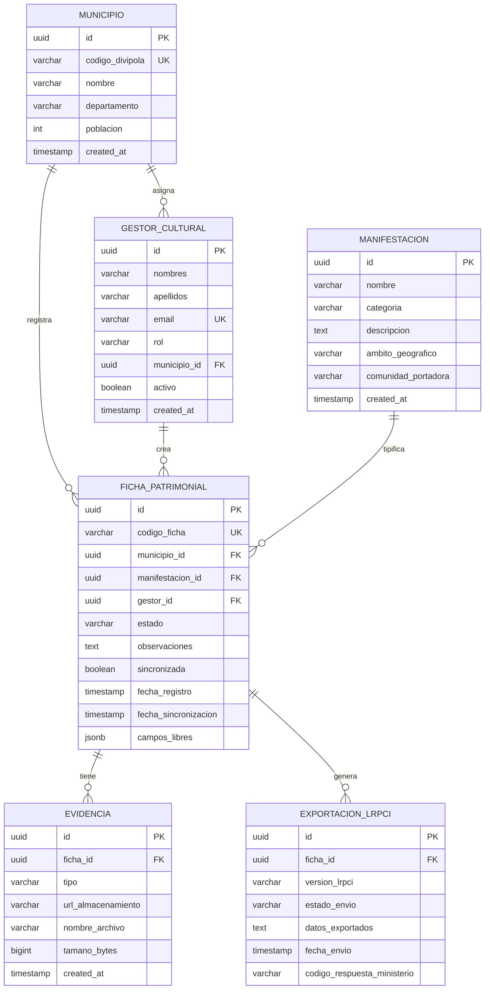

# PatrimonioNariño
## Sistema de Inventario del Patrimonio Cultural Inmaterial · Gobernación de Nariño

---

**Documento de Arquitectura de Software · v1.0**  
**Materia:** Arquitectura de Software  
**Integrantes:** Julian Pedroza Ospina, Catalina Gaviria, Esteban Lasso, Marlon Andrade  
**Semestre:** 5to Semestre  
**Institución:** Universidad Cooperativa de Colombia (UCC) - Campus Pasto  
**Mayo 2026** | **Clasificación: Técnico**

---

Este documento presenta la arquitectura integral del sistema **PatrimonioNariño**, diseñado para la gestión y salvaguardia del Patrimonio Cultural Inmaterial en los 64 municipios del departamento de Nariño, garantizando el cumplimiento de la Ley 1185 de 2008 y la integración con el sistema nacional (LRPCI).

- **Patrón:** Hexagonal (Ports & Adapters)
- **Contexto:** Gobernación de Nariño
- **Municipios:** 64
- **ADRs:** 3 registrados

---

# Resumen Ejecutivo
Para una visión estratégica y de alto nivel del proyecto, descargue el documento oficial aquí:
👉 **[Reporte Resumen Ejecutivo (PDF)](reporte-resumen-ejecutivo.pdf)**

---

## 1. Introducción y Contexto
El sistema **PatrimonioNariño** surge de la necesidad de la Gobernación de Nariño de estandarizar y digitalizar el registro de manifestaciones culturales en sus 64 municipios.

### La Tensión Central
El diseño arquitectónico debe resolver una dicotomía fundamental:
- **Lado A (Flexibilidad Local):** Los gestores culturales necesitan capturar información rica y variable desde dispositivos móviles en zonas rurales sin conexión.
- **Lado B (Rigidez Nacional):** El sistema debe exportar datos al **LRPCI** (Ministerio de Cultura) bajo un esquema rígido y cambiante.

### Modelo de Contexto (C4 Nivel 1)

---

## 2. Drivers Arquitectónicos

### Requerimientos Funcionales Clave
- Registro offline de fichas culturales.
- Sincronización diferida (Store & Forward).
- Exportación automatizada al formato LRPCI del Ministerio.
- Gestión de catálogos de manifestaciones y municipios.

### Atributos de Calidad
| Atributo | Escenario | Respuesta |
| :--- | :--- | :--- |
| **Disponibilidad** | Gestor registra ficha sin señal celular. | El sistema guarda localmente el 100% de los datos. |
| **Modificabilidad** | El Ministerio actualiza el esquema LRPCI. | Cambio completado en < 1 sprint sin tocar el núcleo del dominio. |
| **Interoperabilidad** | Envío de fichas al sistema nacional. | Generación de archivos con 0 errores de formato. |

---

## 3. Elección del Patrón: Arquitectura Hexagonal
Se ha seleccionado la **Arquitectura Hexagonal (Puertos y Adaptadores)** para aislar el núcleo del negocio de las tecnologías externas y los formatos de intercambio.

### Diagrama de Componentes

**Justificación:**
- **Aislamiento:** El dominio (FichaPatrimonial) no conoce el formato del Ministerio.
- **Adaptabilidad:** Los cambios en el LRPCI se absorben en un adaptador de salida específico.
- **Testabilidad:** Permite probar la lógica de negocio sin depender de la base de datos o servicios externos.

---

## 4. Vistas Arquitectónicas (4+1)

### 4.1 Vista Lógica (Contenedores)
El sistema se divide en contenedores claros para separar la interfaz de usuario, la lógica de negocio y el almacenamiento.

### 4.2 Vista de Procesos (Flujo y Secuencia)
A continuación se detalla el flujo de trabajo desde la captura de datos en campo hasta la exportación final.

#### Diagrama de Flujo de Proceso

#### Secuencia Principal

### 4.3 Vista Física (Despliegue)
Infraestructura que soporta la operación en campo y la centralización en la Gobernación.

### 4.4 Escenarios (Casos de Uso)
Interacciones principales de los gestores y administradores.

---

## 5. Modelo de Dominio
El núcleo del sistema define las entidades y reglas de negocio que rigen el patrimonio inmaterial.

---

## 6. Modelo de Datos (ER)
Persistencia estructurada para garantizar la integridad y trazabilidad de los registros.

---

## 7. ADR (Architecture Decision Records)

### ADR-001: Arquitectura hexagonal sobre capas tradicionales
- **Contexto:** Necesidad de aislar la transformación al esquema LRPCI (que cambia periódicamente) de la lógica de captura local.
- **Decisión:** Puertos y adaptadores.
- **Consecuencias:** 
    - `+` Cambios del Ministerio no tocan el dominio.
    - `-` Mayor complejidad inicial de diseño.

### ADR-002: Almacenamiento offline-first con SQLite local
- **Contexto:** Gestores trabajan en zonas rurales sin conectividad.
- **Decisión:** SQLite en dispositivo + sincronización diferida con resolución de conflictos last-write-wins.
- **Consecuencias:** 
    - `+` 100% disponibilidad en campo.
    - `-` Lógica de resolución de conflictos de sync.

### ADR-003: Patrón Adapter versionado para integración LRPCI
- **Contexto:** El Ministerio actualiza periódicamente la estructura LRPCI.
- **Decisión:** Un adaptador independiente por versión del esquema, seleccionado con Strategy.
- **Consecuencias:** 
    - `+` Cambios de versión absorbidos en el adaptador.
    - `-` Mantener historial de versiones de adaptadores.

---

## 8. Patrones de Diseño GoF Aplicados
- **Adapter**: Transformación LRPCI.
- **Strategy**: Versiones del esquema.
- **Repository**: Abstracción de BD.
- **Factory**: Creación de adaptadores.
- **Observer**: Eventos de sync.

---

## 9. Stack Tecnológico Recomendado
| Componente | Tecnología | Detalle |
| :--- | :--- | :--- |
| **Frontend Móvil** | **Flutter** | Cross-platform, offline support, SQLite nativo. |
| **Frontend Web** | **React + TS** | SPA admin panel, ecosistema robusto. |
| **Backend API** | **FastAPI** | Python, async, tipado, DDD-compatible. |
| **Base de Datos** | **PostgreSQL** | JSONB para campos libres, ACID. |
| **Cola de Tareas** | **Celery + Redis** | Exportaciones async sin bloquear API. |
| **Local DB** | **SQLite** | Offline-first en dispositivo móvil. |
| **Infraestructura** | **Docker Compose** | On-premise Gobernación, reproducible. |
| **Autenticación** | **OAuth2 + JWT** | Integración SSO Gobierno Digital. |
| **Almacenamiento** | **MinIO / S3** | Fotos, audio, video de evidencias. |

---

## 10. Atributos de Calidad (Escenarios ISO 25010)
| Atributo | Medida | Detalle |
| :--- | :--- | :--- |
| **Disponibilidad** | **100%** | Fichas guardadas offline sin pérdida, sin importar conectividad. |
| **Modificabilidad** | **< 1 sprint** | Cambio de esquema LRPCI absorbido solo en el adaptador. |
| **Interoperabilidad** | **0 rechazos** | Exportaciones validadas contra esquema oficial antes del envío. |
| **Seguridad** | **OAuth2** | JWT, TLS, RBAC por rol y municipio. |
| **Escalabilidad** | **64 municipios** | Horizontal en API; Celery workers escalables. |
| **Rendimiento** | **< 2s** | P95 respuesta API en condición normal de operación. |

---

## 11. Análisis de la Tensión Arquitectónica
¿En qué punto exacto la tensión es más crítica?

El punto crítico es el **Puerto de Salida hacia el LRPCI** (específicamente el Adaptador de Exportación). Allí es donde la ficha local, rica en detalles, debe transformarse a la estructura rígida nacional.

**Conclusión:**
La arquitectura hexagonal permite que el sistema "respire" localmente con flexibilidad mientras cumple con la "rigidez" necesaria para la interoperabilidad nacional. Se sacrifica simplicidad técnica inicial a cambio de una mantenibilidad superior ante los cambios regulatorios del Ministerio.

---
*Documento generado para la Gobernación de Nariño - 2025*
